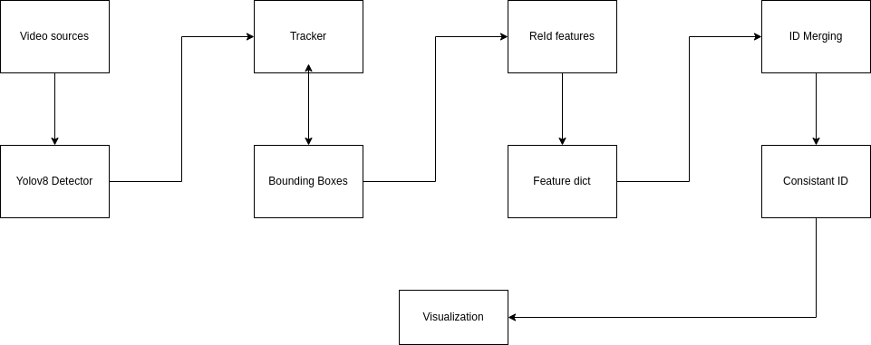

Multiple Real-Time Camera Tracking System

1. Description

This system enables real-time object tracking across multiple video sources(2 camera)
It leverages object detection, tracking, and person re-identification (ReID) techniques to maintain consistent IDs for individuals moving between cameras or obscured momentarily.

2. Pipeline

The system follows a modular pipeline:

2.1 Module Detection

Employs a pre-trained YOLOv8 model (yolov8n.pt by default) to detect objects (likely people) in each video frame from all connected sources.
Outputs bounding boxes and corresponding confidence scores for detected objects.

2.2 Module Tracking

Utilizes a bytetrack tracker (bytetrack.yaml by default) to associate detections across frames within each video source.
Maintains tracklets (temporary object trajectories) and assigns unique IDs to detected objects within a single camera view.

2.3 Module Person ReID

Employs an OSNet-based ReID model (osnet_x0_75 by default) to re-identify the same person across different cameras or when they become temporarily occluded.

Extracts features from detected object crops and compares them to stored features for known IDs.

Distance-based approach using a user-defined threshold (threshold=600 by default) to determine if two detections likely represent the same person.

Merges tracklets when ReID confirms object identity across cameras, ensuring consistent ID assignment throughout the system.

3. Implementation

Prerequisites:

Python 3.x
OpenCV (cv2)
NumPy (np)
Ultralytics (for YOLOv8)

Steps:
Adjust configuration:
Modify det_model, tracker, reid_model, source1, source2, and threshold arguments in the main function (main.py) to suit your environment:
det_model: Path to your YOLOv8 detection model.
tracker: Path to your tracking configuration file (e.g., bytetrack.yaml).
reid_model: Path to your ReID model weights.
source1, source2: Video source paths (webcam index, file paths, or camera stream URLs).
threshold: Distance threshold for ReID-based ID merging.

Run the script: Execute 
    python main.py.